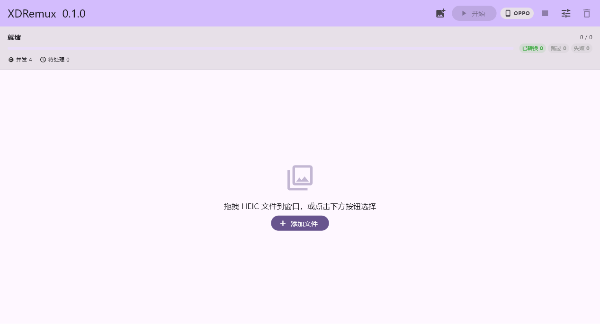

# XDRemux-Flutter

将 OPPO / OnePlus / realme 设备拍摄的 ProXDR HEIC 照片转换为标准 ISO 21496-1 HDR HEIC。

Rust 重写核心转换逻辑（原版 [XDRemux](https://github.com/21Z121Z1/XDRemux) 为 Swift + Python），搭配 Flutter 构建跨平台桌面/移动端 UI。转换后的照片可在 macOS、iOS、Android、Windows 等支持 HDR 显示的系统上查看。

## 截图



## 已实现功能

### 转换

- ✅ LHDR（X6 系列）→ ISO 21496-1 HDR HEIC（gray gain map）
- ✅ UHDR（X7 系列）→ ISO 21496-1 HDR HEIC（RGB gain map）
- ✅ OPPO 相册兼容模式（RGB gain map + 142B tmap + BT.2020 PQ colr）
- ✅ ISO HDR 元数据：XMP hdrgm:*、tmap box、auxC URN、tone map LUTs
- ✅ EXIF UserComment patch（`tail` 标记 OPPO 路由）
- ✅ `xdremux_verify_output` — 验证输出文件是否包含有效 ISO gain map
- ✅ Bit-exact SDR base image（源文件直达，不重新编码）

### Flutter App

- ✅ Windows 桌面应用（含 Gyan.dev ffmpeg 捆绑分发）
- ✅ 拖拽 HEIC 文件到窗口（原生 `WM_DROPFILES`）
- ✅ 文件选择器（`file_picker`）兼容其他平台
- ✅ 多文件队列，并行转换（可配置 1–4 线程）
- ✅ 实时进度条（HEVC tile 级进度：编码第 N/总数 个瓦片）
- ✅ 深色/浅色主题（跟随系统）
- ✅ 中文界面（微软雅黑）
- ✅ OPPO 兼容模式开关
- ✅ 跳过已有有效输出文件
- ✅ 可配置输出目录或文件名后缀
- ✅ 应用图标（同 macOS 版）
- ✅ 鼠标悬停拖拽提示

### 一致性验证

- ✅ 99 个 Rust 单元测试全部通过
- ✅ Tier 1–4 跨实现一致性（vs 原版 Python）通过
- ✅ Apple ImageIO 验证通过

### 多平台

- ✅ Rust 核心（Windows、macOS、Linux）
- ✅ Flutter App（Android、iOS、macOS）

## 快速开始

### Windows 预构建包

下载 Release，解压即用（ffmpeg 已内置，无需额外安装）。

### 从源码构建

```bash
# Rust 核心
cargo build -p xdremux-core --release

# Windows
cd apps/flutter
flutter build windows --debug
```

### Rust CLI

```bash
cargo build --workspace --release
./target/release/xdremux-conformance convert input.heic output.heic
```

## FFI 接口

| 函数 | 用途 |
|------|------|
| `xdremux_version()` | 返回版本号 |
| `xdremux_inspect(path)` | 解析 HEIC，返回 mode / family / edr_scale / gainMapMax |
| `xdremux_convert(in, out, config)` | 转换 ProXDR → ISO HDR |
| `xdremux_read_progress(buf)` | 读取转换进度（阶段 + 当前/总数） |
| `xdremux_verify_output(path)` | 验证输出是否包含 ISO gain map |
| `xdremux_free_result(r)` | 释放 inspect/convert 返回的结果 |

## 输出模式

| 模式 | oppo_compat | Gain map | colr | URN | 目标 |
|------|-------------|----------|------|-----|------|
| 标准 ISO | 0 | 1ch gray HEVC | sRGB | Apple URN | iOS / macOS 相册 |
| OPPO 相册兼容 | 1 | 3ch RGB HEVC | BT.2020 PQ | ImageIO native URN | OPPO 相册 |

## 仓库结构

| 路径 | 用途 |
|------|------|
| `xdremux/rust/` | Rust 核心库 |
| `xdremux/swift-cli/` | Swift CLI（Apple ImageIO 参考实现） |
| `xdremux/python/` | Python CLI（跨平台参考实现） |
| `apps/flutter/` | Flutter 跨平台 App |
| `apps/macos/XDRemuxApp/` | macOS SwiftUI App |
| `tests/conformance/` | 跨实现一致性验证 |
| `fixtures/` | 测试样本说明 |
| `screenshots/` | 应用截图 |

## 未完成 / 未来计划

### UI 与体验

- [ ] 缩略图预览（当前 `generateThumbnail` 已有实现，但未接入 UI）
- [ ] 转换结果预览（源 ↔ 输出对比）
- [ ] 拖入非 HEIC 文件时给出友好提示（当前静默丢弃）
- [ ] 批量输出到自定义目录时保留子目录结构
- [ ] Windows 安装程序（NSIS / MSIX）
- [ ] 自动更新检查

### 核心功能

- [ ] Android 移动端适配（FFI 跨平台已就绪，Android NDK 构建待配）
- [ ] 转换后回退到 OPPO 相册编辑再保存时，HDR Gain Map 不丢失
- [ ] 增量转换——仅重新编码变化的瓦片
- [ ] GPU 加速 HEVC 编码（h265_amf / hevc_nvenc 替代 libx265 软件编码）

### 多平台

- [ ] macOS App Store 签名与公证
- [ ] Linux 测试与打包（AppImage / Flatpak）
- [ ] iOS 端测试

### 工程

- [ ] CI/CD（GitHub Actions 编译测试 + 发布）
- [ ] Flutter widget 测试覆盖
- [ ] macOS / Linux 原生拖拽支持（当前仅 Windows 实现 `WM_DROPFILES`）

## 已知限制

- 转换前请备份原始文件。
- 转换后回到 OPPO 相册编辑再保存，HDR Gain Map 可能丢失。
- Windows 端 ffmpeg 捆绑包体积较大（~200MB），计划调研缩小方案。
- 仅接受 `.heic` 文件拖入（不区分大小写）。

## 运行验证

```bash
python3 tests/conformance/driver.py \
  --sample-dir <sample-dir> \
  --out-report conformance_report.md
```
