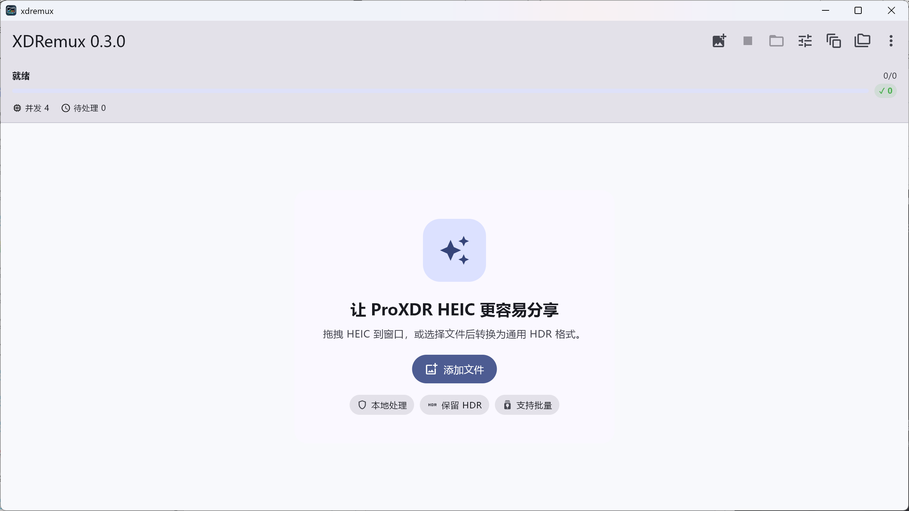
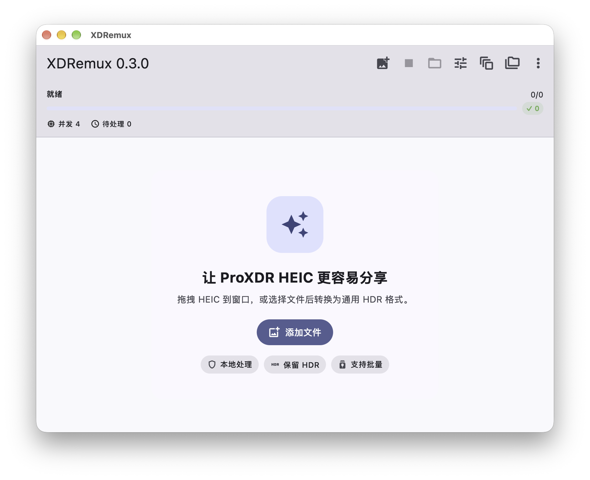
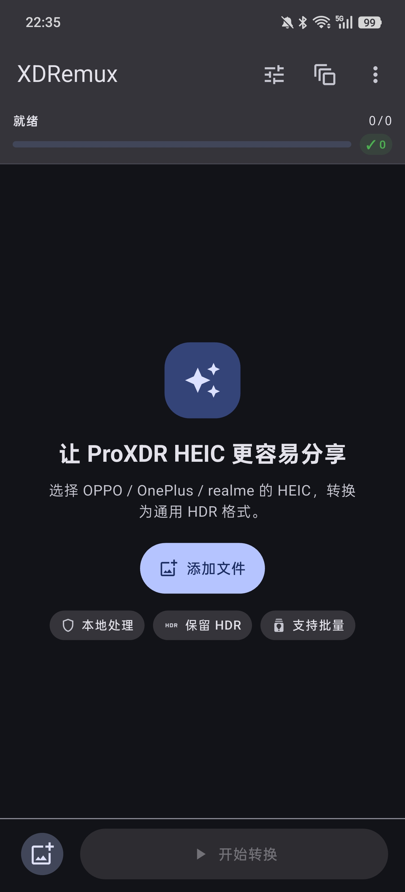
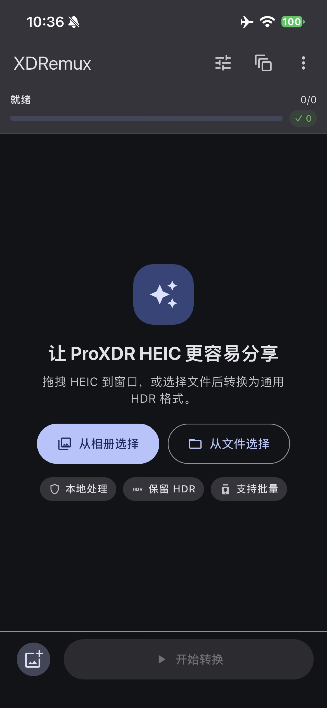

# XDRemux

将 OPPO / OnePlus / realme 拍摄的 ProXDR HEIC，转换为 ISO 21496-1 HDR HEIC，并面向 **OPPO 图库**或 **Apple 照片**生成对应格式。

**一帧影像，动用两台手机。**

Rust 核心转换引擎 + Flutter 跨平台界面，支持 Windows、macOS、Android 和 iOS。
转换目标不是只得到一个“能亮起来的 HDR”，而是根据照片后续在哪里管理，分别保留 ColorOS 可编辑性，或接入 Apple 照片的摄影风格与人像模式流程。

[下载最新版本](https://github.com/BeetMan/XDRemux-Flutter/releases/latest) ·
[问题反馈](https://github.com/BeetMan/XDRemux-Flutter/issues)

> 已适配验证 OPPO / OnePlus / realme 的 ProXDR HEIC（LHDR + UHDR 两种容器），覆盖 Ace 3、Find X6 Pro、Find X7 Ultra、Find X8 Ultra 等样例。
> 如有其他机型或拍摄模式异常，欢迎提交 Issue，并附上机型、拍摄模式和原始 HEIC。

---

## 下载

| 平台 | 最新文件 | 状态 | 说明 |
|---|---|---|---|
| Windows x64 | `XDRemux-Windows-*-Setup.exe` | ✅ 推荐 | 安装包，无需安装 ffmpeg |
| Windows ARM64 | `XDRemux-Windows-arm64-*-Setup.exe` | ✅ CI 自动发布 | Surface Pro X、骁龙本等 ARM64 设备 |
| macOS | `XDRemux-macOS-*.dmg` | ✅ 推荐 | 拖拽到 Applications；首次可能需右键打开 |
| Android | `XDRemux-Android-*.apk` | ✅ 推荐 | SAF 文件导入、保存图库、分享和后台转换 |
| iOS | `XDRemux-iOS-*-unsigned.ipa` | ⚠️ 侧载 | 未签名 IPA，需要自行签名安装 |
| Linux | — | 未提供 | Flutter Linux 目标尚未创建 |

---

## 截图

| Windows | macOS |
|---|---|
|  |  |

| Android | iOS |
|---|---|
|  |  |

---

## 核心能力

### 两种输出模式

#### OPPO 兼容

面向 ColorOS 图库和 OPPO 生态：

- 保留 ColorOS 图库兼容性和继续编辑能力；
- 保留 OPPO 相机元数据和私有尾部数据；
- 支持恢复可见原机水印；
- 适合照片仍主要在 OPPO / 一加 / realme 设备上管理。

#### Apple 标准

面向 Apple 照片和标准 HDR 生态：

- 生成标准 ISO 21496-1 HDR HEIC；
- 配合 Apple 摄影风格、人像模式等能力；
- 不追加 OPPO 私有尾部数据；
- 适合由 iPhone、Apple 照片或其他标准 HDR 应用继续处理。

旧版高级兼容策略仍然保留在设置中，普通使用只需要在“OPPO 兼容”和“Apple 标准”之间选择。

---

## 一帧影像，动用两台手机

这是 0.3.0 的核心工作流：

1. 选择 OPPO 原始照片，生成或复用 OPPO 兼容文件；
2. 生成 Apple 照片摄影风格编辑副本，发送到 iPhone；
3. 在 Apple 照片中继续调整摄影风格或人像相关效果；
4. 将回传照片交给 XDRemux；
5. 根据 OPPO 原始照片恢复可见原机水印、OPPO 元数据和私有尾部数据；
6. 最终选择输出 **OPPO 兼容** 或 **Apple 标准**。


Windows 和 Android 使用 Rust 跨平台 HEIF 编解码器完成解码、水印合成和重新编码；macOS / iOS 继续保留 Apple ImageIO 原生路径。

---

## Apple 摄影风格与人像模式

> 两项功能仍属于实验性能力。目标是输出可以在 Apple 照片中继续编辑的文件，不承诺与 Apple 原生结果逐像素等价。

### Apple 摄影风格

- Rust 全平台实现为默认路径；
- 输出可以在 Apple 照片中继续调节摄影风格；
- macOS / iOS 可切换到原版 Swift 后端；
- 自动生成结果后会进行结构与可编辑性检查。

### Apple 人像模式

- 支持部分带有后置深度数据的 OPPO 人像照片；
- 缺少 `rear.depth` 的照片会自动跳过；
- 不自动 fallback，也不会伪造深度信息；
- 独立人像实验室入口暂时关闭，设置中的人像模式开关保留。

---

## 平台支持

| 平台 | Rust 转换 | OPPO 兼容 | Apple 标准 | 原机水印恢复 | 备注 |
|---|---:|---:|---:|---:|---|
| Windows | ✅ | ✅ | ✅ | ✅ | x265 静态链接；WIC 预览依赖系统 HEIF/HEVC 扩展 |
| Android | ✅ | ✅ | ✅ | ✅ | SAF、分享导入、MediaStore、后台转换 |
| macOS | ✅ | ✅ | ✅ | ✅ | ImageIO 原生路径；可选 Swift 后端 |
| iOS | ✅ | ✅ 实验 | ✅ 实验 | ✅ 实验 | unsigned IPA，自签侧载；部分能力需真机验证 |

---

## 使用说明

### Windows

1. 下载并安装 `XDRemux-Windows-*-Setup.exe`；
2. 拖入 HEIC 文件，或点击选择文件；
3. 选择 **OPPO 兼容** 或 **Apple 标准**；
4. 开始转换。

Windows 队列预览通过系统 WIC 解码 HEIC。若预览不可用，请安装 Microsoft Store 中的“HEIF 图像扩展”和“HEVC 视频扩展”；转换本身不依赖这两个扩展。

### macOS

1. 下载 `XDRemux-macOS-*.dmg`；
2. 将 `XDRemux.app` 拖入 Applications；
3. 首次打开如被 Gatekeeper 拦截，右键选择“打开”；
4. 选择照片或使用“一帧影像，动用两台手机”流程。

### Android

1. 下载并安装 `XDRemux-Android-*.apk`；
2. 使用系统文件选择器导入，或从相册/文件管理器分享到 XDRemux；
3. 转换后可保存到系统图库、分享或重新打开；
4. 后台转换使用前台服务保持任务存活。

Android 使用 SAF，不默认索取完整存储权限。

### iOS

Release 提供 unsigned IPA，需要自行签名安装：

- Xcode + 免费 Apple ID 可侧载；
- AltStore / SideStore / Sideloadly 等签名工具也可使用；
- 免费签名通常 7 天过期；
- 首次安装需在设置中信任开发者证书。

iOS 支持从相册、文件和分享扩展导入 HEIC；Apple 摄影风格、人像模式和 OPPO 写回仍以真机验证结果为准。

---

## 高级功能

<details>
<summary>展开查看高级能力与设置</summary>

### 转换与容器

- LHDR / UHDR 容器识别；
- ISO 21496-1 gain map 与 tmap 元数据写入；
- EXIF 方向感知；
- OPPO 拍摄模式分类；
- 源 SDR 画面位级保留，不重新编码；
- 输出结构验证；
- 可选严格 ISO tmap；
- 可选 GPU gain map 编码（Android MediaCodec / macOS VideoToolbox）。

### App 功能

- 多文件队列与并行转换；
- 转换进度和失败重试；
- 按拍摄模式分目录或分相册输出；
- 自动更新检查；
- 批量完成通知；
- 断点续传；
- Windows 原生拖拽；
- Android 分享接收与后台转换；
- iOS 相册 / 文件 / 分享扩展导入。

### Rust CLI

```bash
cargo build --workspace --release
./target/release/xdremux-conformance convert input.heic output.heic
```

</details>

---

## 从源码构建

### 准备 x265 静态库

HEVC 编码默认使用 vendored x265，Windows / macOS / Android 同一路径，无需安装 ffmpeg。

```bash
# Windows（MSVC）
cmake -S xdremux/rust/vendor/x265/source -B xdremux/rust/vendor/x265/build_windows \
  -G "Visual Studio 17 2022" -A x64 -DENABLE_SHARED=OFF -DENABLE_CLI=OFF \
  -DXDREMUX_SKIP_RC=ON
cmake --build xdremux/rust/vendor/x265/build_windows --config Release --target x265-static

# macOS / Linux
cmake -S xdremux/rust/vendor/x265/source -B xdremux/rust/vendor/x265/build_desktop \
  -DENABLE_SHARED=OFF -DENABLE_CLI=OFF
cmake --build xdremux/rust/vendor/x265/build_desktop --target x265-static -j
```

如需回退到 ffmpeg 子进程编码，构建 Rust 时设置：

```bash
XDREMUX_USE_FFMPEG=1
```

### Rust 核心

```bash
cargo build -p xdremux-core --release
```

### Flutter App

```bash
cd apps/flutter

flutter build windows --release
flutter build macos --release
flutter build apk --release
```

Android 原生库需要先交叉编译：

```bash
cd xdremux/rust
cargo ndk -t arm64-v8a -o "../../apps/flutter/android/app/src/main/jniLibs" build --release
```

iOS 需要：

```bash
rustup target add aarch64-apple-ios
cd xdremux/rust
./build_ios.sh
cd ../../apps/flutter
flutter build ios --release
```

更完整的 iOS 部署、签名和 Swift 后端说明见 `apps/flutter/ios/` 相关配置。

---

## 工程验证

- Rust 单元测试；
- Conformance 一致性验证；
- GitHub Actions CI / Release；
- Windows 与 Android 自动发布；
- macOS DMG 与 iOS unsigned IPA 资产；
- OPPO / Apple 真实设备兼容性仍需按机型验证。

```bash
python3 tests/conformance/driver.py \
  --sample-dir <sample-dir> \
  --out-report conformance_report.md
```

---

## 已知限制

- 转换前请保留原始文件；
- Apple 摄影风格和人像模式为实验性能力，不承诺与 Apple 原生逐像素等价；
- 人像模式要求照片包含后置深度数据；
- OPPO 图库对 OPPO 兼容文件进一步编辑后，HDR gain map 可能丢失；
- iOS 未走 App Store 或 TestFlight，需要自行签名；
- Linux 桌面目标尚未创建。

---

## 仓库结构

| 路径 | 用途 |
|---|---|
| `xdremux/rust/` | Rust 核心、容器解析、水印编解码与 FFI |
| `apps/flutter/` | Flutter App 与 Windows / Android / macOS / iOS 平台集成 |
| `tests/conformance/` | 一致性与结构验证 |
| `docs/` | 转换逻辑、平台行为矩阵和验证记录 |
| `tools/installer/` | Windows 安装包与发布说明 |

原版 Swift / Python 参考实现在上游仓库 [21Z121Z1/XDRemux](https://github.com/21Z121Z1/XDRemux)。

---

## 许可证与边界

本项目用于照片格式转换、容器研究和个人设备间工作流。
Apple 私有框架相关内容仅用于 macOS / iOS 侧载研究，不用于 App Store 分发。
