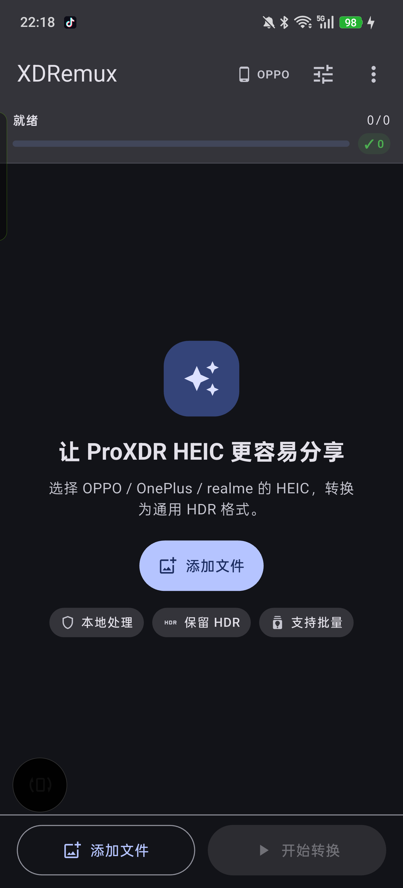

# XDRemux-Flutter

将 OPPO / OnePlus / realme 设备拍摄的 ProXDR HEIC 照片转换为标准 ISO 21496-1 HDR HEIC。

Rust 重写核心转换逻辑（原版 [XDRemux](https://github.com/21Z121Z1/XDRemux) 为 Swift + Python），搭配 Flutter 构建跨平台桌面/移动端 UI。转换后的照片可在 macOS、iOS、Android、Windows 等支持 HDR 显示的系统上查看。

**[下载 v0.2.1（Windows 安装包 / macOS DMG / Android APK）](https://github.com/BeetMan/XDRemux-Flutter/releases/latest)**

## 截图

| Windows | Android |
|---------|---------|
|  |  |

## 已实现功能

### 转换

- ✅ LHDR（X6 系列）→ ISO 21496-1 HDR HEIC（gray gain map）
- ✅ UHDR（X7 系列）→ ISO 21496-1 HDR HEIC（RGB gain map）
- ✅ OPPO 相册兼容模式（RGB gain map + 142B tmap + BT.2020 PQ colr）
- ✅ EXIF 方向感知（gain map transpose + canonical tmap ispe + irot quarter-turns）
- ✅ ISO HDR 元数据：XMP hdrgm:*、tmap box、auxC URN、tone map LUTs
- ✅ EXIF UserComment patch（`tail` 标记 OPPO 路由）
- ✅ 拍摄模式分类（15 种 OPPO 拍摄模式：普通拍照 / 大师模式 / 人像 / 夜景 / 全景 / 延时 / 超清 / 证件照 / 贴纸 / 超级文本 / 合影 / 双重曝光 / 美颜 / 专业模式 / RICOH GR）
- ✅ `xdremux_verify_output` — 验证输出文件是否包含有效 ISO gain map
- ✅ Bit-exact SDR base image（源文件直达，不重新编码）

### Flutter App

- ✅ Windows 桌面应用（x265 静态链接，无需 ffmpeg）
- ✅ Android 移动端应用（x265 静态链接 + 纯 Rust JPEG 解码，无需 ffmpeg）
- ✅ 拖拽 HEIC 文件到窗口（Windows 原生 `WM_DROPFILES`）
- ✅ 文件选择器（`file_picker`）兼容所有平台
- ✅ 多文件队列，并行转换（可配置 1–4 线程）
- ✅ 实时进度条（HEVC tile 级进度：编码第 N/总数 个瓦片）
- ✅ 深色/浅色主题（跟随系统）
- ✅ 中文界面
- ✅ OPPO 兼容模式开关（7 档：Off / Auto / On / Tail / ISO / ISO-NoLocal / ISO-Graph）
- ✅ OPPO 相机尾部元数据策略（11 档：自动 / 不保留 / 仅水印 / 紧凑 / 完整保留 / 多种过滤组合）
- ✅ 严格 ISO tmap 选项（65/145 字节 vs ImageIO 62/142 字节）
- ✅ 跳过已有有效输出文件（入队时自动检测已转换的 ISO HDR 照片）
- ✅ 可配置输出目录或文件名后缀
- ✅ 按拍摄模式分目录输出（普通拍照 / 大师模式 / 人像 …；Android 保存到图库时按模式分相册）
- ✅ 缩略图预览（全平台 Rust FFI 提取 EXIF 内嵌 JPEG 缩略图）
- ✅ Android 保存到图库（MediaStore；按拍摄模式分相册 Pictures/大师模式 等，否则 Pictures/XDRemux）
- ✅ Android 一键保存全部到图库
- ✅ Android 分享（ACTION_SEND）
- ✅ Android 系统图库打开（ACTION_VIEW）
- ✅ Android 后台转换（前台服务保持进程存活，通知栏实时进度，完成时弹通知）
- ✅ Android 电池优化引导（首次转换时引导设置白名单，含 OPPO 耗电行为控制直达入口）
- ✅ Android 分享接收（相册/文件管理器 → 分享 → XDRemux，ACTION_SEND/SEND_MULTIPLE）
- ✅ Android GPU 硬件编码（实验，默认开启，自动探测）：MediaCodec 硬件编码 gain map，单 tile ~40ms，比软件 x265 快一个数量级；开启后 gain map 降至 4:2:0，已在骁龙 8 Elite / 8 Gen 3 上验证通过，设备不支持时自动回退软件编码
- ✅ macOS GPU 硬件编码（VideoToolbox，实验）：复用 macOS 硬件编码器编码 gain map（4:2:0 全范围 NV12），开启强制 OPPO 兼容模式，失败自动回退软件编码
- ✅ macOS 原生 HEIC/HDR 缩略图：ImageIO 从完整 HEIC 解码（替代低质 EXIF 缩略图），应用 HDR 增益映射，转换后照片在照片墙可见明显提亮
- ✅ 源/转换后缩略图切换（macOS only）：转换完成的卡片可切换 HDR 渲染与原始 SDR 对比
- ✅ 断点续传（批量转换中断后可恢复，支持跨会话恢复）
- ✅ 响应式 UI（手机 2 列 / 平板桌面 3 列；<600 宽切紧凑模式、<480 切极简模式）
- ✅ 窗口最小尺寸限制（macOS/Windows 480×800，手机竖屏比例）
- ✅ 队列卡片操作（完成 → 保存/分享/打开；失败 → 重试）
- ✅ 独立"按拍摄模式整理"页（扫描 → 预览 → 复制分类）
- ✅ 自动更新检查（启动时静默查询 GitHub Releases，新版本 SnackBar + 跳转下载页）
- ✅ 转换完成系统通知（Windows toast / Android notification，批量完成时弹出摘要）
- ✅ 缓存与输出目录管理（设置页显示大小，一键清除）
- ✅ Windows MSIX 安装包（`dart run msix:create`）

### 一致性验证

- ✅ 120 个 Rust 单元测试全部通过
- ✅ Tier 1–4 跨实现一致性（vs 原版 Python）通过
- ✅ Apple ImageIO 验证通过

### v0.2.1 关键修复

- **修复 gain map 绿块/花屏（macOS）**：x265 批量编码时每个 gain tile 内嵌了 VPS/SPS/PPS 且切分有 bug（部分 tile 缺 IDR），ImageIO 无法识别为 ISO gain map。改为单帧循环编码——tile 0 保留参数集供 hvcC 提取，后续 tile 纯 IDR。
- **修复 4:2:0/4:4:4 选择逻辑**：之前默认 4:4:4 导致 OPPO 图库识别失败。现在跟随 OPPO 兼容模式——开启时 4:2:0（OPPO 图库要求），关闭时 4:4:4（色度精度最佳）。
- **修复 hvcC profile 解析**：`sps_ptl`/`vps_ptl` 的 NAL 头偏移从 1 字节改为 2 字节，hvcC 正确记录 Main Still Picture profile（此前误标为 Main）。
- **ftyp 加 miaf brand**：macOS ImageIO 识别 ISO gain map 所需。

### 多平台

| 平台 | 状态 | 备注 |
|------|------|------|
| Windows | ✅ 可运行 | x265 静态链接、原生拖拽、DLL 完整工作 |
| macOS | ✅ 可运行 | FFI dylib 加载、VideoToolbox GPU 编码、ImageIO 原生 HDR 缩略图、源/转换后切换 |
| Android | ✅ 可运行 | x265 静态链接、纯 Rust JPEG 解码、后台转换、MediaStore 保存、MediaCodec GPU 硬件编码（实验） |
| iOS | ⚠️ 骨架已创建 | Rust core + x265 交叉编译静态库、FFI 链接已通；UI/Share Extension 待完善 |
| Linux | ❌ 未创建 | `flutter create` 待执行 |

## 快速开始

### Windows 预构建包

下载 Release 的 `XDRemuxSetup-x.y.z.exe`（Inno Setup 安装包，~12MB），双击安装，
开始菜单/桌面快捷方式自动生成；HEVC 编码由内置 x265 静态库完成，无需安装 ffmpeg。

自行打包：

```bash
flutter build windows --release
iscc tools\installer\xdremux.iss   # 需 Inno Setup 6
# 产物：apps/flutter/build/installer/XDRemuxSetup-<version>.exe
```

也支持 MSIX（`dart run msix:create`），适合未来上架 Microsoft Store。

### macOS 预构建包

下载 Release 的 `XDRemux-x.y.z-macos.dmg`（~25MB），打开后拖拽 `xdremux.app` 到
Applications 文件夹安装。首次打开可能需右键 → 打开（绕过 Gatekeeper 警告）。
HEVC 编码由内置 x265 静态库完成，无需安装 ffmpeg。

自行打包：

```bash
flutter build macos --release
# 产物：apps/flutter/build/macos/Build/Products/Release/xdremux.app
# 打成 dmg（含 Applications 快捷方式）：
mkdir -p /tmp/dmg && cp -R apps/flutter/build/macos/Build/Products/Release/xdremux.app /tmp/dmg/
ln -s /Applications /tmp/dmg/Applications
hdiutil create -volname "XDRemux x.y.z" -srcfolder /tmp/dmg -ov -format UDZO \
  XDRemux-x.y.z-macos.dmg
```

### 从源码构建

HEVC 编码由静态链接的 x265 完成（Windows/macOS/Android 同一路径），需先从
`xdremux/rust/vendor/x265/` 构建静态库（vendored 源码，约 2 分钟）：

```bash
# Windows（MSVC，一次即可；需 NASM 以启用 x265 SIMD 汇编加速，否则自动退回纯 C 构建）
cmake -S xdremux/rust/vendor/x265/source -B xdremux/rust/vendor/x265/build_windows \
  -G "Visual Studio 17 2022" -A x64 -DENABLE_SHARED=OFF -DENABLE_CLI=OFF \
  -DXDREMUX_SKIP_RC=ON
cmake --build xdremux/rust/vendor/x265/build_windows --config Release --target x265-static

# macOS / Linux
cmake -S xdremux/rust/vendor/x265/source -B xdremux/rust/vendor/x265/build_desktop \
  -DENABLE_SHARED=OFF -DENABLE_CLI=OFF
cmake --build xdremux/rust/vendor/x265/build_desktop --target x265-static -j
```

如需回退到 ffmpeg 子进程编码（调试用），构建 Rust 时设 `XDREMUX_USE_FFMPEG=1`。

```bash
# Rust 核心
cargo build -p xdremux-core --release

# Windows
cd apps/flutter
flutter build windows --debug

# Android（需 cargo-ndk + NDK）
cd xdremux/rust
cargo ndk -t arm64-v8a -o "../../apps/flutter/android/app/src/main/jniLibs" build --release
cd ../../apps/flutter
flutter build apk --debug

# iOS（骨架已创建；需 rustup target add aarch64-apple-ios）
cd xdremux/rust
./build_ios.sh   # 交叉编译 x265 + Rust staticlib，stage 到 ~/xdremux_ios_libs
cd ../../apps/flutter
flutter build ios --no-codesign   # 需 CocoaPods；pod install 由 flutter build 触发
```

**iOS 链接注意**：FFI 符号通过 `DynamicLibrary.process()` 运行时查找，编译期无引用，
链接器 `-dead_strip` 会移除 Rust 静态库的符号。Podfile 的 post_install 已给全部
`_xdremux_*` 符号加 `-u` 阻止 strip（见 `apps/flutter/ios/Podfile`）。

### Rust CLI

```bash
cargo build --workspace --release
./target/release/xdremux-conformance convert input.heic output.heic
```

## FFI 接口

| 函数 | 用途 |
|------|------|
| `xdremux_version()` | 返回版本号 |
| `xdremux_inspect(path)` | 解析 HEIC，返回 mode / family / edr_scale / gainMapMax |
| `xdremux_convert(in, out, config)` | 转换 ProXDR → ISO HDR |
| `xdremux_read_progress(buf)` | 读取转换进度（阶段 + 当前/总数） |
| `xdremux_verify_output(path)` | 验证输出是否包含 ISO gain map |
| `xdremux_extract_thumbnail(path)` | 提取 HEIC 内嵌 EXIF JPEG 缩略图 |
| `xdremux_classify(path)` | 解析拍摄模式，返回 modeKey / folderName / status |
| `xdremux_free_result(r)` | 释放 inspect/convert 返回的结果 |
| `xdremux_free_classification_result(r)` | 释放 classify 返回的结果 |
| `xdremux_free_thumbnail(r)` | 释放缩略图结果 |

## 输出模式

| 模式 | oppo_compat | Gain map | colr | URN | 目标 |
|------|-------------|----------|------|-----|------|
| 标准 ISO | 0 (off) | 1ch gray HEVC | sRGB | Apple URN | iOS / macOS 相册 |
| OPPO 相册兼容 | 1-3 (auto/on/tail) | 3ch RGB HEVC 4:2:0 | BT.2020 PQ | ImageIO native URN | OPPO 相册 |
| ISO 路由 | 4-6 (iso/iso-no-local/iso-graph) | 1ch gray 或 3ch RGB | sRGB | Apple URN | 通用 ISO HDR |

`oppo_compat` 完整取值：0=off, 1=auto, 2=on, 3=tail, 4=iso, 5=iso-no-local, 6=iso-graph。

## 仓库结构

| 路径 | 用途 |
|------|------|
| `xdremux/rust/` | Rust 核心库（含 `categorize.rs` 拍摄模式分类） |
| `xdremux/swift-cli/` | Swift CLI（Apple ImageIO 参考实现） |
| `xdremux/python/` | Python CLI（跨平台参考实现） |
| `apps/flutter/` | Flutter 跨平台 App（Windows / macOS / Android） |
| `apps/macos/XDRemuxApp/` | macOS SwiftUI App |
| `tests/conformance/` | 跨实现一致性验证 |
| `fixtures/` | 测试样本说明 |
| `screenshots/` | 应用截图 |

## 未完成 / 未来计划

### UI 与体验

- [ ] 转换结果预览（源 ↔ 输出对比）
- [ ] 拖入非 HEIC 文件时给出友好提示（当前静默丢弃）
- [ ] 批量输出到自定义目录时保留子目录结构
- [x] Windows 安装程序（MSIX，`dart run msix:create`）
- [x] 自动更新检查（启动时查询 GitHub Releases，新版本 SnackBar 提示）

### 核心功能

- [ ] 转换后回退到 OPPO 相册编辑再保存时，HDR Gain Map 不丢失
- [ ] 增量转换——仅重新编码变化的瓦片
- [ ] 桌面 GPU 加速 HEVC 编码（h265_amf / hevc_nvenc 替代 libx265 软件编码；Android 端已通过 MediaCodec 实现，见"已实现功能"）

### 多平台

- [ ] macOS App Store 签名与公证
- [ ] Linux 测试与打包（AppImage / Flatpak）
- [ ] iOS 适配（`flutter create` 待执行）

### 工程

- [x] CI/CD（GitHub Actions 编译测试 + 发布）——Windows/Android 已自动发布
- [x] macOS 原生拖拽支持（NSView 覆层 MethodChannel）
- [ ] macOS 加入 release CI（当前手动构建 dmg）
- [ ] iOS 完善（Share Extension、后台转换、真机验证）
- [ ] Linux 版（`flutter create` 待执行）

## 已知限制

- 转换前请备份原始文件。
- 转换后回到 OPPO 相册编辑再保存，HDR Gain Map 可能丢失。
- 转换输入接受 `.heic` / `.heif` 文件（不区分大小写）；拖入其他格式时会明确提示忽略数量。
- Android 缩略图依赖 EXIF 内嵌 JPEG（部分文件可能无缩略图）；macOS/iOS 用原生 ImageIO 解码完整 HEIC。

## 运行验证

```bash
python3 tests/conformance/driver.py \
  --sample-dir <sample-dir> \
  --out-report conformance_report.md
```
