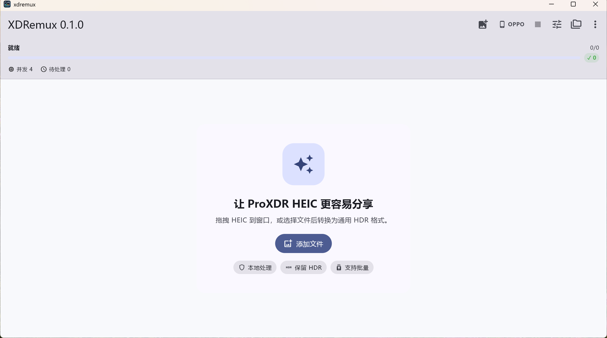

# XDRemux-Flutter

将 OPPO / OnePlus / realme 设备拍摄的 ProXDR HEIC 照片转换为标准 ISO 21496-1 HDR HEIC。

Rust 重写核心转换逻辑（原版 [XDRemux](https://github.com/21Z121Z1/XDRemux) 为 Swift + Python），搭配 Flutter 构建跨平台桌面/移动端 UI。转换后的照片可在 macOS、iOS、Android、Windows 等支持 HDR 显示的系统上查看。

## 截图



## 已实现功能

### 转换

- ✅ LHDR（X6 系列）→ ISO 21496-1 HDR HEIC（gray gain map）
- ✅ UHDR（X7 系列）→ ISO 21496-1 HDR HEIC（RGB gain map）
- ✅ OPPO 相册兼容模式（RGB gain map + 142B tmap + BT.2020 PQ colr）
- ✅ EXIF 方向感知（gain map transpose + canonical tmap ispe + irot quarter-turns）
- ✅ ISO HDR 元数据：XMP hdrgm:*、tmap box、auxC URN、tone map LUTs
- ✅ EXIF UserComment patch（`tail` 标记 OPPO 路由）
- ✅ 拍摄模式分类（15 种 OPPO 拍摄模式：普通拍照 / 大师模式 / 人像 / 夜景 / 全景 / 延时 / 超清 / 证件照 / 贴纸 / 超级文本 / 合影 / 双重曝光 / 美颜 / 专业模式 / RICOH GR）
- ✅ `xdremux_verify_output` — 验证输出文件是否包含有效 ISO gain map
- ✅ Bit-exact SDR base image（源文件直达，不重新编码）

### Flutter App

- ✅ Windows 桌面应用（x265 静态链接，无需 ffmpeg）
- ✅ Android 移动端应用（x265 静态链接 + 纯 Rust JPEG 解码，无需 ffmpeg）
- ✅ 拖拽 HEIC 文件到窗口（Windows 原生 `WM_DROPFILES`）
- ✅ 文件选择器（`file_picker`）兼容所有平台
- ✅ 多文件队列，并行转换（可配置 1–4 线程）
- ✅ 实时进度条（HEVC tile 级进度：编码第 N/总数 个瓦片）
- ✅ 深色/浅色主题（跟随系统）
- ✅ 中文界面
- ✅ OPPO 兼容模式开关（7 档：Off / Auto / On / Tail / ISO / ISO-NoLocal / ISO-Graph）
- ✅ OPPO 相机尾部元数据策略（11 档：自动 / 不保留 / 仅水印 / 紧凑 / 完整保留 / 多种过滤组合）
- ✅ 严格 ISO tmap 选项（65/145 字节 vs ImageIO 62/142 字节）
- ✅ 跳过已有有效输出文件
- ✅ 可配置输出目录或文件名后缀
- ✅ 按拍摄模式分目录输出（普通拍照 / 大师模式 / 人像 …）
- ✅ 缩略图预览（全平台 Rust FFI 提取 EXIF 内嵌 JPEG 缩略图）
- ✅ Android 保存到图库（MediaStore；开启"按拍摄模式分目录"时按模式分相册，否则 DCIM/XDRemux）
- ✅ Android 分享（ACTION_SEND）
- ✅ Android 系统图库打开（ACTION_VIEW）
- ✅ 断点续传（批量转换中断后可恢复，支持跨会话恢复）
- ✅ 响应式 UI（手机 2 列 / 平板桌面 3 列）
- ✅ 输出操作菜单（保存到图库 / 分享 / 系统打开；桌面另支持保存到源目录、打开输出目录）
- ✅ 独立"按拍摄模式整理"页（扫描 → 预览 → 复制分类）
- ✅ 自动更新检查（启动时静默查询 GitHub Releases，新版本 SnackBar + 跳转下载页）
- ✅ Windows MSIX 安装包（`dart run msix:create`）

### 一致性验证

- ✅ 120 个 Rust 单元测试全部通过
- ✅ Tier 1–4 跨实现一致性（vs 原版 Python）通过
- ✅ Apple ImageIO 验证通过

### 多平台

| 平台 | 状态 | 备注 |
|------|------|------|
| Windows | ✅ 可运行 | x265 静态链接、原生拖拽、DLL 完整工作 |
| macOS | ✅ 可运行 | FFI dylib 加载 + macOS Runner 已验证 |
| Android | ✅ 可运行 | x265 静态链接、纯 Rust JPEG 解码、缩略图 FFI、MediaStore 保存 |
| Linux | ❌ 未创建 | `flutter create` 待执行 |
| iOS | ❌ 未创建 | `flutter create` 待执行 |

## 快速开始

### Windows 预构建包

下载 Release，解压即用（HEVC 编码由内置 x265 静态库完成，无需安装 ffmpeg）。
也提供 MSIX 安装包（双击安装，出现开始菜单项）。

自行打包 MSIX：

```bash
flutter build windows --release
dart run msix:create        # 测试证书签名；正式分发需替换为自己的证书
```

### 从源码构建

HEVC 编码由静态链接的 x265 完成（Windows/macOS/Android 同一路径），需先从
`xdremux/rust/vendor/x265/` 构建静态库（vendored 源码，约 2 分钟）：

```bash
# Windows（MSVC，一次即可）
cmake -S xdremux/rust/vendor/x265/source -B xdremux/rust/vendor/x265/build_windows \
  -G "Visual Studio 17 2022" -A x64 -DENABLE_SHARED=OFF -DENABLE_CLI=OFF \
  -DENABLE_ASSEMBLY=OFF -DXDREMUX_SKIP_RC=ON
cmake --build xdremux/rust/vendor/x265/build_windows --config Release --target x265-static

# macOS / Linux
cmake -S xdremux/rust/vendor/x265/source -B xdremux/rust/vendor/x265/build_desktop \
  -DENABLE_SHARED=OFF -DENABLE_CLI=OFF -DENABLE_ASSEMBLY=OFF
cmake --build xdremux/rust/vendor/x265/build_desktop --target x265-static -j
```

如需回退到 ffmpeg 子进程编码（调试用），构建 Rust 时设 `XDREMUX_USE_FFMPEG=1`。

```bash
# Rust 核心
cargo build -p xdremux-core --release

# Windows
cd apps/flutter
flutter build windows --debug

# Android（需 cargo-ndk + NDK）
cd xdremux/rust
cargo ndk -t arm64-v8a -o "../../apps/flutter/android/app/src/main/jniLibs" build --release
cd ../../apps/flutter
flutter build apk --debug
```

### Rust CLI

```bash
cargo build --workspace --release
./target/release/xdremux-conformance convert input.heic output.heic
```

## FFI 接口

| 函数 | 用途 |
|------|------|
| `xdremux_version()` | 返回版本号 |
| `xdremux_inspect(path)` | 解析 HEIC，返回 mode / family / edr_scale / gainMapMax |
| `xdremux_convert(in, out, config)` | 转换 ProXDR → ISO HDR |
| `xdremux_read_progress(buf)` | 读取转换进度（阶段 + 当前/总数） |
| `xdremux_verify_output(path)` | 验证输出是否包含 ISO gain map |
| `xdremux_extract_thumbnail(path)` | 提取 HEIC 内嵌 EXIF JPEG 缩略图 |
| `xdremux_classify(path)` | 解析拍摄模式，返回 modeKey / folderName / status |
| `xdremux_free_result(r)` | 释放 inspect/convert 返回的结果 |
| `xdremux_free_classification_result(r)` | 释放 classify 返回的结果 |
| `xdremux_free_thumbnail(r)` | 释放缩略图结果 |

## 输出模式

| 模式 | oppo_compat | Gain map | colr | URN | 目标 |
|------|-------------|----------|------|-----|------|
| 标准 ISO | 0 (off) | 1ch gray HEVC | sRGB | Apple URN | iOS / macOS 相册 |
| OPPO 相册兼容 | 1-3 (auto/on/tail) | 3ch RGB HEVC 4:2:0 | BT.2020 PQ | ImageIO native URN | OPPO 相册 |
| ISO 路由 | 4-6 (iso/iso-no-local/iso-graph) | 1ch gray 或 3ch RGB | sRGB | Apple URN | 通用 ISO HDR |

`oppo_compat` 完整取值：0=off, 1=auto, 2=on, 3=tail, 4=iso, 5=iso-no-local, 6=iso-graph。

## 仓库结构

| 路径 | 用途 |
|------|------|
| `xdremux/rust/` | Rust 核心库（含 `categorize.rs` 拍摄模式分类） |
| `xdremux/swift-cli/` | Swift CLI（Apple ImageIO 参考实现） |
| `xdremux/python/` | Python CLI（跨平台参考实现） |
| `apps/flutter/` | Flutter 跨平台 App（Windows / macOS / Android） |
| `apps/macos/XDRemuxApp/` | macOS SwiftUI App |
| `tests/conformance/` | 跨实现一致性验证 |
| `fixtures/` | 测试样本说明 |
| `screenshots/` | 应用截图 |

## 未完成 / 未来计划

### UI 与体验

- [ ] 转换结果预览（源 ↔ 输出对比）
- [ ] 拖入非 HEIC 文件时给出友好提示（当前静默丢弃）
- [ ] 批量输出到自定义目录时保留子目录结构
- [x] Windows 安装程序（MSIX，`dart run msix:create`）
- [x] 自动更新检查（启动时查询 GitHub Releases，新版本 SnackBar 提示）

### 核心功能

- [ ] 转换后回退到 OPPO 相册编辑再保存时，HDR Gain Map 不丢失
- [ ] 增量转换——仅重新编码变化的瓦片
- [ ] GPU 加速 HEVC 编码（h265_amf / hevc_nvenc 替代 libx265 软件编码）

### 多平台

- [ ] macOS App Store 签名与公证
- [ ] Linux 测试与打包（AppImage / Flatpak）
- [ ] iOS 适配（`flutter create` 待执行）

### 工程

- [ ] CI/CD（GitHub Actions 编译测试 + 发布）
- [ ] macOS / Linux 原生拖拽支持（当前仅 Windows 实现 `WM_DROPFILES`）
- [ ] 缩略图解码回退（当前仅支持 EXIF 内嵌 JPEG，无兜底）

## 已知限制

- 转换前请备份原始文件。
- 转换后回到 OPPO 相册编辑再保存，HDR Gain Map 可能丢失。
- 仅接受 `.heic` 文件（不区分大小写）。
- Android 缩略图依赖 EXIF 内嵌 JPEG，部分文件可能无缩略图。

## 运行验证

```bash
python3 tests/conformance/driver.py \
  --sample-dir <sample-dir> \
  --out-report conformance_report.md
```
