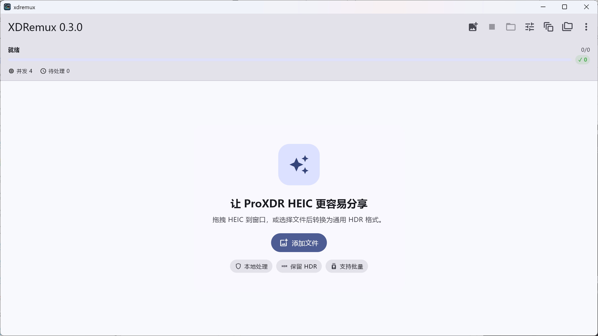
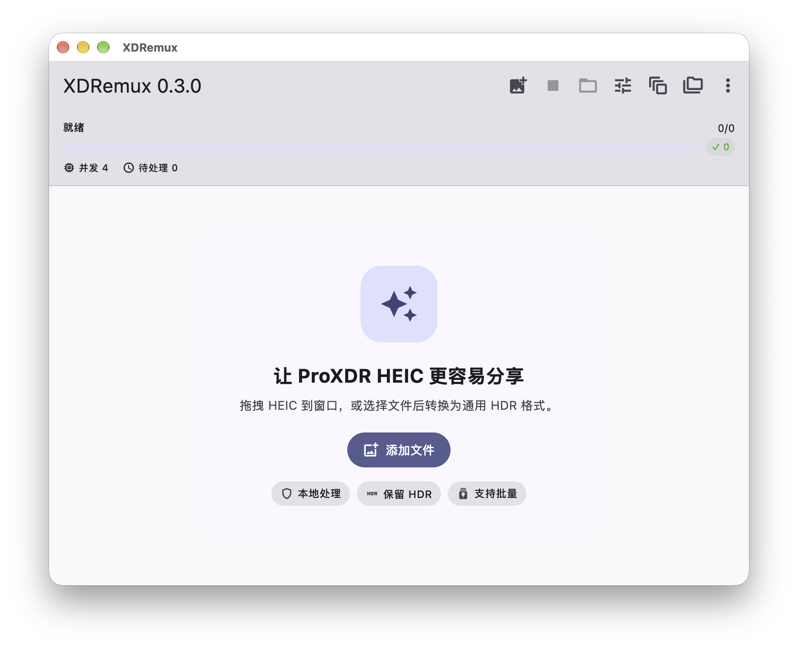
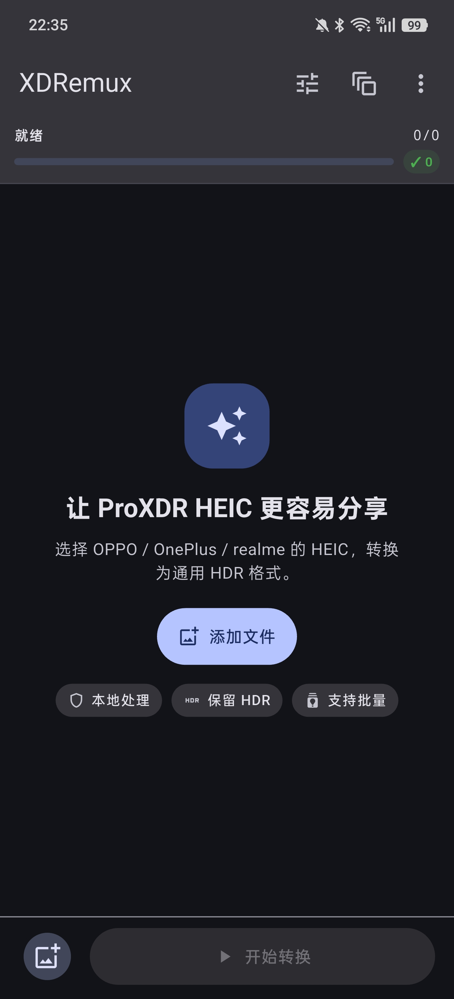
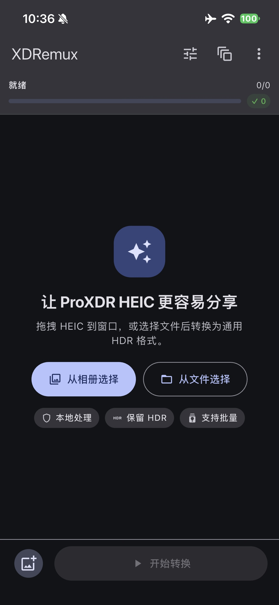

# XDRemux

**让照片跨越设备，也保留继续创作的可能。**

XDRemux 是一款跨平台照片格式转换工具。它将 OPPO、一加、realme 拍摄的 ProXDR 照片转换为标准 HDR HEIC，并根据后续使用场景选择「OPPO 兼容」或「Apple 标准」输出。

除了 HDR 转换，还支持符合条件的 OPPO / 华为人像转换、Apple 摄影风格数据写入，以及动态照片拆分与 Live Photo 配对。你可以在不同设备之间管理、编辑和回传照片，而不只是得到一张能显示的图片。

Flutter 跨平台版采用 **Flutter 界面 + Rust 图像处理引擎**，覆盖 Windows、macOS、Android、iOS 和 HarmonyOS。HarmonyOS 另有共用 Rust 引擎的 ArkUI 原生预览版。

[下载最新版本](https://github.com/BeetMan/XDRemux-Flutter/releases/latest) · [问题反馈](https://github.com/BeetMan/XDRemux-Flutter/issues) · [技术文档](docs/README.md) · [鸿蒙原生版](https://github.com/BeetMan/XDRemux-Flutter/tree/feat/harmony-native)

> 当前跨平台版本：**v0.4.3**。鸿蒙原生预览版：**0.5.0-alpha1**。
> Apple 摄影风格、人像及 Live Photo 等能力包含实验性实现，实际效果取决于原始照片结构、系统版本和目标设备。请保留原图，先用少量照片验证自己的工作流。

## 下载与安装

[v0.4.3 发布页](https://github.com/BeetMan/XDRemux-Flutter/releases/tag/v0.4.3) 同时提供跨平台版和鸿蒙原生预览版。请选择对应平台的文件：

| 平台 / 版本 | 安装包 | 安装方式 |
|---|---|---|
| Windows x64 · Flutter | [Setup.exe](https://github.com/BeetMan/XDRemux-Flutter/releases/download/v0.4.3/XDRemux-Windows-0.4.3-Setup.exe) | 运行安装器，无需另装 ffmpeg |
| macOS · Flutter | [DMG](https://github.com/BeetMan/XDRemux-Flutter/releases/download/v0.4.3/XDRemux-macOS-0.4.3.dmg) | 将应用拖入 Applications |
| Android · Flutter | [APK](https://github.com/BeetMan/XDRemux-Flutter/releases/download/v0.4.3/XDRemux-Android-0.4.3.apk) | 安装 APK |
| iOS · Flutter | [未签名 IPA](https://github.com/BeetMan/XDRemux-Flutter/releases/download/v0.4.3/XDRemux-iOS-0.4.3-unsigned.ipa) | 需自行签名侧载 |
| HarmonyOS · Flutter | [未签名 HAP](https://github.com/BeetMan/XDRemux-Flutter/releases/download/v0.4.3/XDRemux-HarmonyOS-0.4.3-unsigned.hap) | 需本地签名安装 |
| HarmonyOS · ArkUI 原生预览版 | [0.5.0-alpha1 未签名 HAP](https://github.com/BeetMan/XDRemux-Flutter/releases/download/v0.4.3/XDRemux-HarmonyOS-Native-0.5.0-alpha1-unsigned.hap) | 需本地签名安装，详情见[原生分支说明](https://github.com/BeetMan/XDRemux-Flutter/blob/feat/harmony-native/README.md) |

当前发布不提供 Windows ARM64 安装包，也未创建 Flutter Linux 桌面目标。

iOS 与 HarmonyOS 安装包未签名，不能直接按普通商店应用安装。HarmonyOS 请通过 DevEco Studio 配置本地签名；iOS 请使用适合自己设备的签名与侧载方式。

## 选择照片的输出方式

应用提供两种主要输出模式。**它们面向不同的照片管理生态，不是画质高低的选择。**

| 输出模式 | 适用场景 |
|---|---|
| **OPPO 兼容** | 继续在 OPPO / 一加 / realme 图库管理照片，可按设置保留相机元数据、私有尾部数据与继续编辑所需的信息。 |
| **Apple 标准** | 面向 Apple 照片与标准 HDR 工作流，不追加 OPPO 私有尾部数据，并可按照片条件写入摄影风格或人像编辑数据。 |

ProXDR 转换支持 LHDR / UHDR 容器，将原有增益图转换为 ISO 21496-1 HDR 数据。HDR 能否显示、图库是否允许继续编辑，仍取决于目标应用与设备。

## 从导入到导出

Flutter 版以转换队列为主要入口：导入照片、查看详情、选择选项，再集中处理和导出。

1. **添加照片**：通过系统选择器导入 HEIC、HEIF 或 JPEG；支持的平台也可通过系统分享或桌面拖放添加。
2. **查看详情**：检查文件格式、尺寸、EXIF、HDR 类型、拍摄模式，以及识别到的动态照片信息。
3. **选择转换方式**：在设置中选择输出模式，按需开启摄影风格、人像或动态照片处理。
4. **开始转换**：在队列中查看进度与结果，失败项目可重试，也可调整设置后重新转换。
5. **导出结果**：桌面端使用输出目录；移动端可保存静帧到图库或分享文件。Live Photo 请保留并一起导入配对文件。

应用还提供队列检查点恢复、分类输出、完成通知和中英文界面。移动端采用紧凑队列与底部操作栏，桌面端提供更宽的队列和详情布局；文件访问与后台运行能力按平台有所不同。

### 界面预览

| Windows | macOS |
|---|---|
|  |  |

| Android | iOS |
|---|---|
|  |  |

## Apple 摄影风格：让照片可以继续编辑

选择 Apple 标准输出后，可为支持的照片生成摄影风格编辑数据，让照片在支持的 Apple 照片版本与设备上继续调整。

- **摄影风格**：写入完整的风格编辑结构，而不只是改变照片的显示效果。
- **摄影风格 3（质感 + 颗粒）**：在基础摄影风格上加入用于质感、胶片颗粒与光晕编辑的数据；开启时会同时启用基础摄影风格。
- **普通照片也可使用**：支持的普通 HEIC / HEIF / JPEG 可通过重编码生成完整风格容器，不限于 OPPO ProXDR。

Rust 为默认实现；macOS / iOS 还保留可选的 Swift 后端。华为照片的专用处理路径始终使用 Rust，即使 Apple 平台选择了 Swift。

需要注意：

- OPPO ProXDR 走 HDR 转换路径；已验证的华为原生 HDR 走专用保留路径。其他普通照片的风格重建路径输出 SDR + 风格，不保证保留原有 HDR 增益图。
- 普通照片的语义分区蒙版仍包含占位实现，柔肤效果尚未完整实现；不代表具有与 Apple 原生照片相同的主体分割能力。
- 部分非 Standard 风格的调节参数尚未支持，效果不承诺与 Apple 原生逐像素等价。

## 人像：保留景深，交给 Apple 照片继续调整

人像转换依赖原始照片中真实存在、且可读取的深度信息。应用不会从普通照片中自动生成景深，也不会伪造人像数据。

### OPPO 人像

支持带 `rear.depth` 的 OPPO 人像照片，包括受支持的 HEIC 与 JPEG 导出结构。转换时优先使用尾部 `src.image` 中未虚化、未裁切、无品牌水印的相机底图，结合每张照片的深度标定数据生成 Apple 人像结构。

在 Apple 照片中关闭人像效果时可查看清晰底图，开启后由景深数据渲染虚化。**人像效果通常需要在 Apple 照片中手动开启**。缺少可用 `src.image` 时会回退到 OPPO 主图；缺少受支持深度数据则跳过人像转换。

### 华为人像 · v0.4.3

新增已验证的 **Mate 70 人像 HEIC → Apple 人像** 路径，包含视差、对焦区域、人像光效与主体蒙版，并支持在该路径上追加摄影风格数据。

这项支持以现有 Mate 70 原始样片为依据，不代表所有华为机型与拍摄模式都已适配。实现与验证范围见[人像管线](docs/modules/portrait-pipeline.md)和[设备兼容矩阵](docs/validation/device-compat-matrix.md)。

## 动态照片：拆分资源，或生成 Live Photo 配对

XDRemux 可识别受支持的 OPPO / Android Motion Photo，以及华为 OpenHarmony 动态照片，查看其中可读取的视频规格、时长和音轨信息。

你可以按后续使用需求选择：

- **仅静帧**：提取并处理照片画面。
- **静帧 + 视频**：拆分资源，分别保存和使用。
- **Live Photo 配对**：生成带配对标识与封面时刻的同名 HEIC + MOV，供 Apple 照片导入。

已支持的结构包括 Android V1 / legacy MicroVideo、HEIF `mpvd`、OPPO LPEX，以及已验证的华为追加视频结构。

> **Live Photo 是两个文件，不是一张 HEIC。** 请将 HEIC 和 MOV 一起导入 Apple 照片。当前「保存图库」与单文件分享只处理静帧，不会自动创建系统 Live Photo 资产；实况播放与声音仍需在目标设备上验证。

## 华为 HDR：已经兼容的照片，不必重复转换

已验证的 Mate 70 系列原生 HDR 照片包含标准增益图，默认会提示「无需转换」，保留原文件。需要添加 Apple 摄影风格、转换人像或处理动态照片时，再使用相应功能。

华为照片的识别、风格附加、人像及动态照片处理共用 Rust 管线，在五个平台上使用同一套核心逻辑。**共用逻辑不等于所有设备都已完成真机验收**，具体样片与平台验证记录见[华为支持计划](docs/plans/huawei-to-apple-plan.md)。

XMAGE `xtstyle` 目前用于只读诊断，尚未实现华为色彩风格到 Apple 摄影风格的语义映射。

## 一帧影像，动用两台手机

如果你希望用 OPPO 拍摄、在 iPhone 上编辑，再把照片带回 OPPO，应用提供独立的往返工作流：

1. 保留 OPPO 原始照片，生成 Apple 照片编辑副本。
2. 将副本发送到 iPhone，在 Apple 照片中调整摄影风格或人像效果。
3. 将编辑后的照片回传 XDRemux，并配对原始照片。
4. 按需恢复原机水印、OPPO 元数据和私有尾部数据，选择 OPPO 兼容或 Apple 标准输出。

原图是恢复信息的依据，请不要只保留编辑副本。OPPO 图库对兼容文件再次编辑后，HDR 增益图仍可能丢失，建议先确认目标设备的表现。

## 平台差异与鸿蒙原生版

跨平台版共用 Rust 核心，导入、预览、导出与后台运行则使用各平台的集成方式：

- **Windows**：支持原生拖放。HEIC 队列预览使用系统 WIC，预览不可用时需检查系统 HEIF / HEVC 解码支持；转换本身不依赖这些预览扩展。
- **macOS**：支持 Rust / Swift 后端选择，保留 Apple 原生 ImageIO 相关路径。
- **Android**：使用系统文件选择器导入，支持分享接收、保存图库与前台服务后台转换；系统省电策略仍可能影响任务运行。
- **iOS**：支持相册、文件与分享扩展导入，可选择 Rust / Swift 后端；提供自行签名的 IPA，未通过 App Store / TestFlight 分发。
- **HarmonyOS（Flutter）**：通过鸿蒙 Flutter 引擎与插件接入系统选择器、分享和图库，使用同一套 Rust 转换核心。

**鸿蒙原生预览版**在 [`feat/harmony-native`](https://github.com/BeetMan/XDRemux-Flutter/tree/feat/harmony-native) 分支开发，采用 ArkTS / ArkUI，围绕「图库、队列、设置」组织界面。它共用 Rust 引擎，提供 HDR、摄影风格、人像与动态照片等核心能力；图库浏览、任务管理和导出交互则采用原生实现。

原生版使用独立包名，可与 Flutter 版共存。当前版本为 **0.5.0-alpha1**，不意味着跨平台主线已经升级到 0.5.0。原生界面、构建方式与兼容边界请以[原生版 README](https://github.com/BeetMan/XDRemux-Flutter/blob/feat/harmony-native/README.md)为准。

## 使用前需要了解

- **保留原始照片**：尽量导入未经社交软件压缩或图库重编码的原文件，私有尾部、深度或动态资源可能在转存时丢失。
- **输入受照片结构限制**：当前 App 选择器接受 HEIC / HEIF / JPEG，不等于所有这些扩展名的照片都可完成所有转换。
- **部分 HEVC 输入尚不支持**：纯 Rust 解码路径暂不支持 4:2:2 / 4:4:4，部分 iPhone HEIC 截图可能失败。进展见[解码平台覆盖计划](docs/plans/sdr-decode-platform-coverage.md)。
- **Apple 编辑能力属于实验功能**：以支持的系统、设备与照片结构为准，不保证与原生拍摄结果完全等价。
- **设备兼容性按样片增量验证**：已有样片通过并非整个平台或品牌的全面背书。

反馈问题时，请附上运行平台、设备型号、系统与应用版本、转换选项、错误信息，以及可用于复现的原始样片。照片可能包含位置等隐私信息，分享前请确认授权与隐私范围。

## 开发与技术文档

产品说明与工程细节分开维护，构建和研究资料请从以下入口查阅：

- [技术文档索引](docs/README.md)：架构、后端、FFI、照片格式与模块说明。
- [五平台构建指南](docs/operations/building.md)：Rust、x265、Flutter 与鸿蒙构建。
- [发版指南](docs/operations/releasing.md)：打包、签名边界与发布检查。
- [一致性测试](docs/testing/conformance-suite.md)：结构验证、样片回归与测试流程。
- [设备兼容矩阵](docs/validation/device-compat-matrix.md)：已验证样片、平台证据和已知问题。
- [v0.4.3 更新记录](tools/installer/RELEASE_NOTES_v0.4.3.md)：本次华为支持与可靠性改进。
- [鸿蒙原生工程说明](https://github.com/BeetMan/XDRemux-Flutter/blob/feat/harmony-native/apps/harmony/README.md)：原生版构建、本地签名与设备安装。

主线仓库结构：

| 路径 | 用途 |
|---|---|
| `xdremux/rust/` | Rust 图像处理核心、容器解析、风格 / 人像 / 动态照片与 FFI |
| `apps/flutter/` | Flutter App 与五平台集成 |
| `tests/conformance/` | 一致性与结构验证 |
| `docs/` | 技术文档、研究计划与验证记录 |
| `tools/` | 平台构建、安装器与发布工具 |

鸿蒙原生工程 `apps/harmony/` 位于原生开发分支，并非当前主线的 Flutter 应用目录。

## 致谢与许可

本项目基于 [21Z121Z1/XDRemux](https://github.com/21Z121Z1/XDRemux) 的研究与原版 Swift / Python 实现开展跨平台移植，感谢上游作者及提供样片、验证与反馈的贡献者。

仓库许可见 [LICENSE](LICENSE)，第三方组件遵循各自许可证。Apple 私有框架相关路径用于 macOS / iOS 侧载研究，不用于 App Store 分发。
